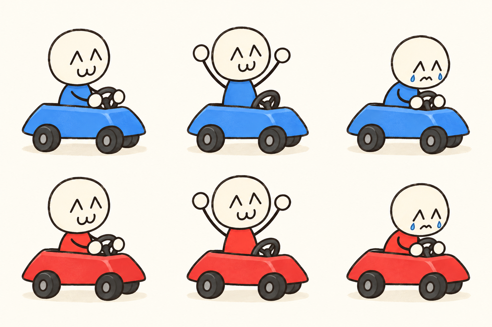

# 레이싱 게임 기획과 캐릭터

게임 구현 전 검토를 위한 산출물이다. 앱 코드나 배포 결과는 포함하지 않는다.

1. [게임 기획서](02-game-design.md): 게임 흐름, 터치 조작, 2~6인 화면 배치, 공격·부스터, 결과와 재경기, 첫 구현 범위.
2. [원본 기획서 해석](01-source-notes.md): 손그림 두 장에서 읽은 내용과 불명확한 부분.
3. [캐릭터 콘셉트 시트](characters/blue-red-character-sheet.png): Blue·Red의 주행·승리·패배 모습.
4. [생성 프롬프트와 제작 기록](characters/generation-prompt.md).
5. [보완 기획 — 공유 트랙·공유 아이템·속도감](03-shared-track-revision.md): 첫 구현 이후의 보완 요구와 다음 개발 세션용 구현 안내. 02 문서와 충돌하면 이 문서가 우선한다.
6. [보완 기획 — 손그림 개선안](04-sketch-feedback.md): 공격 속도, 레이저, 도로 크기, 1등 부스터 제한, 시상대. 03 문서와 충돌하면 이 문서가 우선한다.

확정된 방향은 아이패드·휴대폰의 **한 기기 동시 터치**, **원본 손그림 느낌을 살린 깔끔한 2D**다. 밸런스 수치와 화면 구성은 검토 가능한 제안으로 구분했다.

